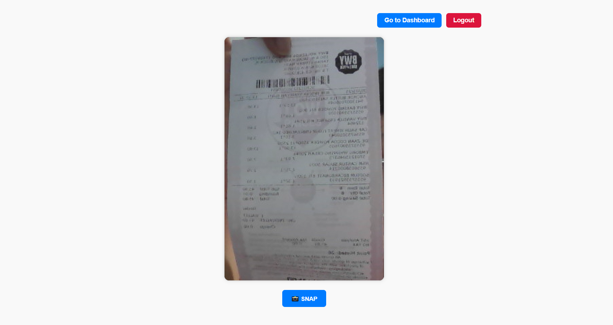
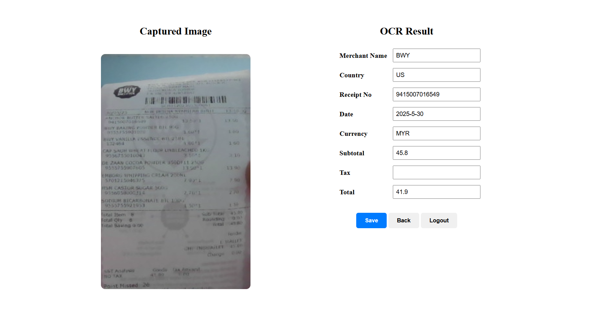
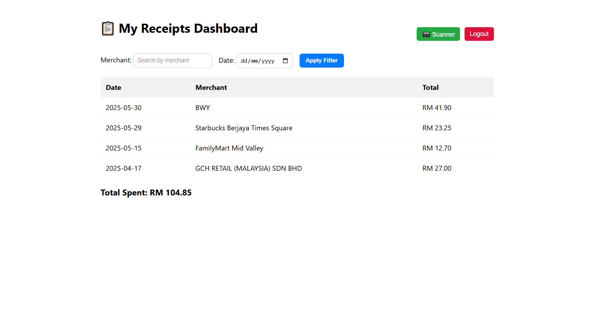

# receipt_scanner

# 📷 SmartReceipt – Receipt Scanner Web App

SmartReceipt is a web application that helps users scan, edit, and track their spending through digital receipts. Built with HTML, CSS, JavaScript, and Supabase for data storage, this project aims to reduce manual entry time and help users manage their expenses efficiently.

---

## 🚀 Features

- 📸 Scan receipts using your webcam
- 🔎 Auto-extract fields like date, merchant name, and total using OCR
- ✏️ Edit extracted data before saving
- 📊 View total spend and filter by merchant or date
- 🔐 Secure user-specific data handling with Supabase

---

## 🖼️ Screenshots

### 1️⃣ Scanner Interface

Users can scan physical receipts using their webcam. Once the image is captured, it is sent for OCR processing to extract relevant data.

---

### 2️⃣ OCR Result & Editing

After scanning, the extracted data is displayed on the right. Users can review and correct any fields before saving to the database.

---

### 3️⃣ Dashboard View

The dashboard displays saved receipts, total spending, and allows users to filter records by merchant or date. This helps track expenses in a clean, centralized view.

---

## 🛠️ Tech Stack

- HTML, CSS, JavaScript
- Supabase (Auth & Database)
- OCR API (for extracting text from images)

---

## 📌 Goals

- ✅ Automate and simplify receipt tracking
- ✅ Reduce paper clutter and manual entry
- ✅ Provide a user-friendly dashboard for expense monitoring

---

## 📂 How to Use

1. Clone the repo  
2. Set up your Supabase credentials in `.env.local`  
3. Run `npm install`  
4. Start the project with `npm run dev`

---

## 📧 Contact

For questions or collaborations, feel free to reach out!

